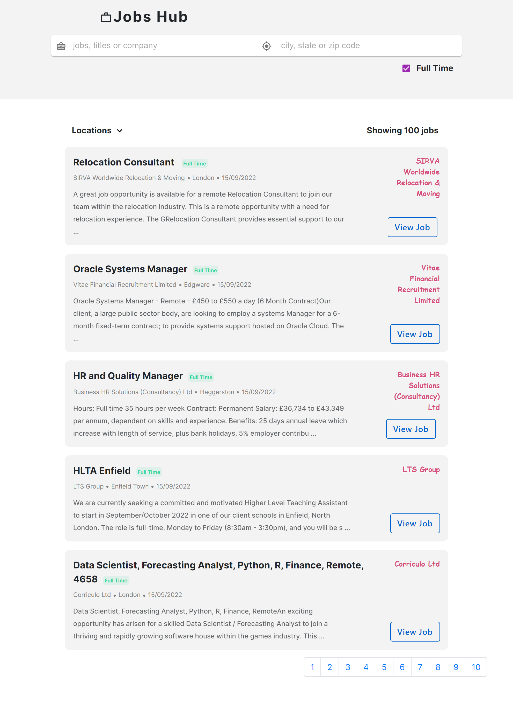
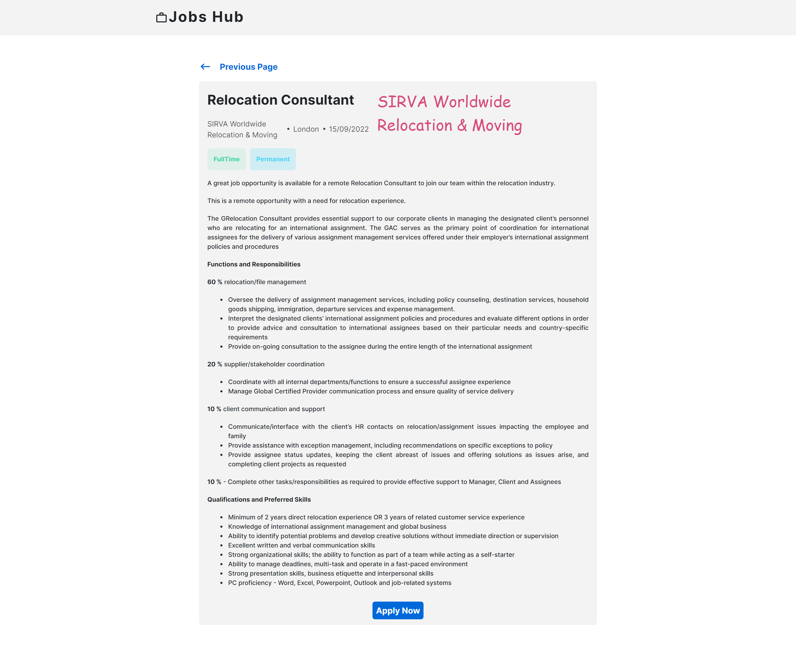

# Jobs Hub
## Overview
 A job portal to allow users to search for jobs.

### Features

- Search for jobs by keyword
- Search for jobs by location
- Filter jobs by job type (Full time, Part time or contract)
- View jobs based on selected city

### Installation

```
npm start
```

### Dependencies

- Axios
- Styled Components
- Mui Material
- React Router
### Technologies Used

- React
- TypeScript
- Styled Components
- Material Icons
- Mui Material Components

### API


- Reed JobSeeker API [https://www.reed.co.uk/developers/Jobseeker](https://www.reed.co.uk/developers/Jobseeker)

### Deployment

- Netlify [https://amalitech-jobs-hub.netlify.app/](https://amalitech-jobs-hub.netlify.app/)


## Screenshots
- Jobs Page


- Job Detail Page



